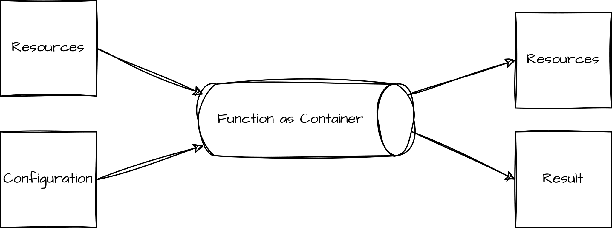
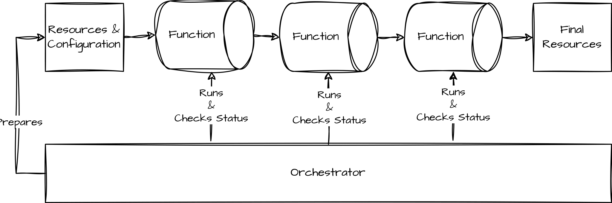

# Kustomize Enhancement with KRM Functions

* https://www.innoq.com/en/blog/2023/03/kustomize-enhancement-with-krm-functions/

- Part 1: [Kustomize Introduction](https://www.innoq.com/en/blog/kustomize-introduction/)
  第 1 部分：Kustomize 简介

- Part 2: [Kustomize Advanced Features](https://www.innoq.com/en/blog/advanced-kustomize-features/)
  第 2 部分：定制高级功能

- Part 3: Kustomize Enhancement with KRM functions (this article)
  第 3 部分：使用 KRM 功能进行 Kustomize 增强（本文）

In the first two articles, we have seen that although simplicity is a key aspect of Kustomize, it is still a powerful tool to manage client-side Kubernetes resources. Nevertheless, there are still some features lacking that we would probably like to have:
在前两篇文章中，我们已经看到，尽管简单性是 Kustomize 的一个关键方面，但它仍然是管理客户端 Kubernetes 资源的强大工具。尽管如此，仍然缺少一些我们可能希望拥有的功能：

- We may want to generate complex resource structures from a simple configuration containing all the best practices defined by a platform team
  我们可能希望从包含平台团队定义的所有最佳实践的简单配置生成复杂的资源结构

- We may want to run validations on generated resources on the client side to not have to wait for the real deployment
  我们可能希望在客户端对生成的资源运行验证，而不必等待真正的部署

- We may want to inject cross-cutting functionality in to all resources like setting a sidecar.
  我们可能希望将横切功能注入到所有资源中，例如设置 sidecar。

Kustomize has always had some kind of means to add functionality by building plugins. From Kustomize’s point of view, the generators and transformers are already kind of plugins anyway. In the past, however, the plugins were proprietary and complicated to build in the form of [executable scripts](https://kubectl.docs.kubernetes.io/guides/extending_kustomize/exec_plugins/) or [go plugins](https://kubectl.docs.kubernetes.io/guides/extending_kustomize/go_plugins/). This way is becoming [deprecated](https://github.com/kubernetes/enhancements/tree/master/keps/sig-cli/2953-kustomize-plugin-graduation) and will be replaced by a more KRM-driven approach. One of the first steps is to introduce KRM functions as an alpha feature.
Kustomize 一直有某种方法通过构建插件来添加功能。从 Kustomize 的角度来看，无论如何，发电机和变压器已经是一种插件了。然而，在过去，这些插件是专有的，并且以可执行脚本或 go 插件的形式构建起来很复杂。这种方式已被弃用，并将被更加 KRM 驱动的方法所取代。第一步是将 KRM 功能作为 Alpha 功能引入。

### What is KRM?
什么是KRM？

KRM stands for [Kubernetes Resource Model](https://github.com/kubernetes/design-proposals-archive/blob/main/architecture/resource-management.md) and is a definition of the API-focus design that defines the Kubernetes core. This is probably one of the most important reasons for the success of Kubernetes as it defines more or less a common API to request all kinds of operational needs in the form of resources. Every requirement such as load-balancing, auto-scaling, routing, placement of pods, and gateway is defined as a resource. Additionally, Kubernetes supports the extension of known resources in the form of CRDs (Custom Resource Definition). So in short, KRM defines the way we interact with Kubernetes via resources.
KRM 代表 Kubernetes 资源模型，是定义 Kubernetes 核心的以 API 为中心的设计的定义。这可能是 Kubernetes 成功的最重要原因之一，因为它或多或少定义了一个通用 API，以资源的形式请求各种操作需求。每个需求（例如负载均衡、自动扩展、路由、Pod 放置和网关）都被定义为资源。此外，Kubernetes 支持以 CRD（自定义资源定义）形式扩展已知资源。简而言之，KRM 定义了我们通过资源与 Kubernetes 交互的方式。

### What are KRM Functions?
什么是 KRM 功能？

The KRM function specification defines how to manipulate a list of KRM resources. Simplified, it describes how a containerized application (the function) shall receive a list of resources and additional, optional, configurations. It also describes how it provides a new list of resources and optionally a result:
KRM 函数规范定义了如何操作 KRM 资源列表。简而言之，它描述了容器化应用程序（功能）应如何接收资源列表和附加的可选配置。它还描述了它如何提供新的资源列表和可选的结果：



The function uses the resources and results as follows:
该函数使用资源和结果如下：

- If the function generates new resources or manipulates resources given as an input, it will output the new list of resources
  如果该函数生成新资源或操作作为输入给出的资源，它将输出新的资源列表

- If the function validates the given resources based on rules, it will output the result
  如果该函数根据规则验证给定的资源，它将输出结果

You can roughly group functions into Transformers and Generators on the one side and Validators on the other.
您可以粗略地将函数分为一侧的转换器和生成器，另一侧的验证器。

Let’s have a look at an example input for a function described in the specification
让我们看一下规范中描述的函数的示例输入

```yaml
apiVersion: config.kubernetes.io/v1
kind: ResourceList
functionConfig:
  apiVersion: foo-corp.com/v1
  kind: FulfillmentCenter
  metadata:
    name: staging
  spec:
    address: "100 Main St."
items:
  - apiVersion: v1
    kind: Service
    metadata:
      name: wordpress
      labels:
        app: wordpress
      annotations:
        internal.config.kubernetes.io/index: "0"
        internal.config.kubernetes.io/path: "service.yaml"
    spec: # Example comment
      type: LoadBalancer
      selector:
        app: wordpress
        tier: frontend
      ports:
        - protocol: TCP
          port: 80
```

The input is read from stdin as a yaml structure named `ResourceList` with two parts.
输入从 stdin 读取为名为 `ResourceList` 的 yaml 结构，由两部分组成。

**functionConfig** This describes the configuration for this function. We will see later how we build our configuration and function
functionConfig 描述此功能的配置。稍后我们将看到如何构建我们的配置和功能

**items** This is a list of items our function will work on.
items 这是我们的函数将处理的项目列表。

After the function runs, an example output looks like this:
函数运行后，示例输出如下所示：

```yaml
apiVersion: config.kubernetes.io/v1
kind: ResourceList
items:
  - apiVersion: v1
    kind: Service
    metadata:
      name: wordpress
      labels:
        app: wordpress
      annotations:
        internal.config.kubernetes.io/index: "0"
        internal.config.kubernetes.io/path: "service.yaml"
    spec: # Example comment
      type: LoadBalancer
      selector:
        app: wordpress
        tier: frontend
      ports:
        - protocol: TCP
          port: 80
results:
  - message: "Invalid type. Expected: integer, given: string"
    severity: error
    resourceRef:
      apiVersion: v1
      kind: Service
      name: wordpress
    field:
      path: spec.ports.0.port
    file:
      path: service.yaml
```

It has two parts, again.
它又分为两个部分。

**items** The new list of items is used for further processing. Deleted items will no longer be processed by the next step.
items 新的项目列表用于进一步处理。已删除的项目将不再被下一步处理。

**results** A list of structural validation results. If the function has an unstructured result, e.g. it can not parse the input, it would return with a status code other than `0`.
results 结构验证结果列表。如果函数有非结构化结果，例如它无法解析输入，它将返回 `0` 以外的状态代码。

### What is Kustomize in the KRM Function Context?
KRM 功能上下文中的 Kustomize 是什么？

Besides the function definition, the specification defines an orchestrator for functions. In the end, this is a tool that would prepare the correct input for a function and will take the output to either stop further processing (in case of a failure) or to forward it to the next function in the chain.
除了函数定义之外，规范还定义了函数的协调器。最后，这是一个工具，可以为函数准备正确的输入，并将输出停止进一步处理（如果发生故障）或将其转发到链中的下一个函数。



Kustomize is an orchestrator from the perspective of a function but the specification is not limited to Kustomize. There are other implementations of an orchestrator available.
Kustomize从功能角度来说是一个编排器，但规范并不限于Kustomize。还有其他可用的编排器实现。

### Build a KRM Function
构建 KRM 功能

Let’s create our function to see how it works with Kustomize. The goal is that we want to reduce the errors when creating typical resources defining an application. Our application consists of a deployment and a service. It exposes an endpoint. When we do this manually, we have to create a Deployment resource and a Service resource which are correctly configured so that the Service endpoints are mapped to the correct port in the Deployment.
让我们创建我们的函数来看看它如何与 Kustomize 配合使用。我们的目标是在创建定义应用程序的典型资源时减少错误。我们的应用程序由部署和服务组成。它公开了一个端点。当我们手动执行此操作时，我们必须创建正确配置的部署资源和服务资源，以便服务端点映射到部署中的正确端口。

Therefore, what we want to build is a generator that can generate these resources for us based on a simple configuration with a few fields. The configuration we are aiming for is as follows:
因此，我们想要构建的是一个生成器，它可以基于带有几个字段的简单配置为我们生成这些资源。我们的目标配置如下：

```yaml
# app.yaml
apiVersion: app.innoq.com/v1
kind: App
metadata:
  name: hello
spec:
  size: medium
  image: test:123
  port: 8080
```

As you can see, a KRM function configuration is also expressed in the form of a Kubernetes resource. This configuration is, however, only used on the client side. Therefore, Kubernetes does not need to know this structure, only Kustomize. The 3 values we want to make configurable are the port, the image, and the size. The size is a T-shirt size value to define how much CPU and memory the service gets. The values are `small`, `medium`, and `large` to make it easier for developers to define.
正如您所看到的，KRM 功能配置也是以 Kubernetes 资源的形式表达的。然而，此配置仅在客户端使用。因此，Kubernetes 不需要知道这个结构，只需要 Kustomize。我们想要配置的 3 个值是端口、图像和大小。大小是一个 T 恤尺寸值，用于定义服务获得多少 CPU 和内存。这些值是 `small` 、 `medium` 和 `large` ，以便开发人员更容易定义。

Whilst this is a very simple definition of an app that ignores many aspects such as auto-scaling or configurations and secrets, based on this setup we could extend the function later with everything we want to have.
虽然这是一个非常简单的应用程序定义，忽略了自动缩放或配置和秘密等许多方面，但基于此设置，我们可以稍后使用我们想要的一切来扩展该功能。

So, first we have to create a new golang project containing the code for our function.
因此，首先我们必须创建一个新的 golang 项目，其中包含我们的函数的代码。

```bash
$ mkdir app-creator
$ cd app-creator
$ go mod init app-creator
$ touch main.go
$ touch templates.go
```

The next step is to create templates for the deployment and the service.
下一步是为部署和服务创建模板。

```go
// templates.go
package main

const SERVICE_TEMPLATE = `
apiVersion: v1
kind: Service
metadata:
 name: {{ .Metadata.Name }}
spec:
 selector:
   app: {{ .Metadata.Name }}
 ports:
 - port: {{ .Spec.Port }}
   targetPort: {{ .Spec.Port }}`

const DEPLOYMENT_TEMPLATE = `
apiVersion: apps/v1
kind: Deployment
metadata:
  name: {{ .Metadata.Name }}
spec:
  selector:
    matchLabels:
      app: {{ .Metadata.Name }}
  template:
    metadata:
      labels:
        app: {{ .Metadata.Name }}
    spec:
      containers:
      - name: {{ .Metadata.Name }}
        image: {{ .Spec.Image }}
        resources:
          limits:
            {{ if eq .Spec.Size "large" }}
            memory: "1024"
            cpu: "1"
            {{ else if eq .Spec.Size "medium" }}
            memory: "512Mi"
            cpu: "500m"
            {{ else }}
            memory: "256Mi"
            cpu: "250m"
            {{ end }}
        ports:
        - containerPort: {{ .Spec.Port }}`
```

These are inline golang templates defined as variables we can use in the main function. We can already see the if-else block to map the T-shirt size to concrete CPU and memory limits.
这些是内联 golang 模板，定义为我们可以在 main 函数中使用的变量。我们已经可以看到 if-else 块将 T 恤尺寸映射到具体的 CPU 和内存限制。

Next, we need to install some golang packages which help to implement the function.
接下来，我们需要安装一些golang包来帮助实现该功能。

```bash
$ go get sigs.k8s.io/kustomize/kyaml/fn/framework \
       sigs.k8s.io/kustomize/kyaml/fn/framework/command \
       sigs.k8s.io/kustomize/kyaml/fn/framework/parser

go: added github.com/asaskevich/govalidator v0.0.0-20190424111038-f61b66f89f4a
go: added github.com/davecgh/go-spew v1.1.1
go: added github.com/go-errors/errors v1.4.2
go: added github.com/go-openapi/jsonpointer v0.19.6
go: added github.com/go-openapi/jsonreference v0.20.1
go: added github.com/go-openapi/swag v0.22.3
go: added github.com/golang/protobuf v1.5.2
go: added github.com/google/gnostic v0.5.7-v3refs
go: added github.com/google/go-cmp v0.5.5
go: added github.com/google/gofuzz v1.1.0
go: added github.com/inconshreveable/mousetrap v1.0.0
go: added github.com/josharian/intern v1.0.0
go: added github.com/mailru/easyjson v0.7.7
go: added github.com/mitchellh/mapstructure v1.4.1
go: added github.com/monochromegane/go-gitignore v0.0.0-20200626010858-205db1a8cc00
go: added github.com/spf13/cobra v1.4.0
go: added github.com/spf13/pflag v1.0.5
go: added github.com/xlab/treeprint v1.1.0
go: added golang.org/x/sys v0.3.0
go: added google.golang.org/protobuf v1.28.0
go: added gopkg.in/yaml.v2 v2.4.0
go: added gopkg.in/yaml.v3 v3.0.1
go: added k8s.io/kube-openapi v0.0.0-20230109183929-3758b55a6596
go: added k8s.io/utils v0.0.0-20220210201930-3a6ce19ff2f9
go: added sigs.k8s.io/kustomize/kyaml v0.14.0
go: added sigs.k8s.io/yaml v1.3.0
```

Kustomize provides some helper structs and functions to simplify the implementation.
Kustomize 提供了一些辅助结构和函数来简化实现。

The next step is to implement the function.
下一步是实现该功能。

```go
// main.go
package main

import (
    "os"

    "sigs.k8s.io/kustomize/kyaml/fn/framework"
    "sigs.k8s.io/kustomize/kyaml/fn/framework/command"
    "sigs.k8s.io/kustomize/kyaml/fn/framework/parser"
    "sigs.k8s.io/kustomize/kyaml/kio"
    "sigs.k8s.io/kustomize/kyaml/yaml"
)

type Metadata struct {
    Name string `yaml:"name"`
}

type AppSpec struct {
    Image string `yaml:"image"`
    Port  int32  `yaml:"port"`
    Size  string `yaml:"size,omitempty"`
}

type App struct {
    Metadata Metadata `yaml:"metadata"`
    Spec     AppSpec  `yaml:"spec"`
}

func main() {
    config := &App{}
    fn := framework.TemplateProcessor{
        TemplateData:       config,
        PostProcessFilters: []kio.Filter{kio.FilterFunc(filterAppFromResources)},
        ResourceTemplates: []framework.ResourceTemplate{{
            Templates: parser.TemplateStrings(DEPLOYMENT_TEMPLATE, SERVICE_TEMPLATE),
        }},
    }
    cmd := command.Build(fn, command.StandaloneDisabled, false)
    command.AddGenerateDockerfile(cmd)
    if err := cmd.Execute(); err != nil {
        os.Exit(1)
    }
}

func filterAppFromResources(items []*yaml.RNode) ([]*yaml.RNode, error) {
    var newNodes []*yaml.RNode
    for i := range items {
        meta, err := items[i].GetMeta()
        if err != nil {
            return nil, err
        }
        // remove resources with the kind App from the resource list
        if meta.Kind == "App" && meta.APIVersion == "app.innoq.com/v1" {
            continue
        }
        newNodes = append(newNodes, items[i])
    }
    items = newNodes
    return items, nil
}
```

The three structs map to our configuration above. Kustomize provides some helper functions to build functions for some typical use cases, in our case a template-based processor (see `framework.TemplateProcessor`). We provide some templates and the configuration. Then, the framework fills the configuration with the real values from the configuration before merging the configuration with the templates.
这三个结构映射到我们上面的配置。 Kustomize 提供了一些辅助函数来为一些典型用例构建函数，在我们的例子中是基于模板的处理器（请参阅 `framework.TemplateProcessor` ）。我们提供一些模板和配置。然后，框架在将配置与模板合并之前，使用配置中的实际值填充配置。

The filter function `filterAppFromResources` is just a precaution in case the function configuration is also present in the resource list. This function filters out the App resource before delivering the result.
过滤器功能 `filterAppFromResources` 只是一种预防措施，以防功能配置也出现在资源列表中。该函数在传递结果之前过滤掉应用程序资源。

There are other helper functions for other use cases. For more examples have a look at [the examples in the package documentation](https://pkg.go.dev/sigs.k8s.io/kustomize/kyaml@v0.14.0/fn/framework/example).
对于其他用例还有其他辅助函数。有关更多示例，请查看包文档中的示例。

With `command.AddGenerateDockerfile`, we can automatically generate a Dockerfile for our function.
使用 `command.AddGenerateDockerfile` ，我们可以为我们的函数自动生成 Dockerfile。

```bash
$ go run *.go gen .
```

The corresponding Dockerfile looks like this:
对应的 Dockerfile 如下所示：

```Dockerfile
FROM golang:1.19-alpine as builder
ENV CGO_ENABLED=0
WORKDIR /go/src/
COPY go.mod go.sum ./
RUN go mod download
COPY . .
RUN go build -ldflags '-w -s' -v -o /usr/local/bin/function ./

FROM alpine:latest
COPY --from=builder /usr/local/bin/function /usr/local/bin/function
ENTRYPOINT ["function"]
```

Now, we can generate our containerized function
现在，我们可以生成容器化函数

```bash
$ docker build -t app-creator:1.0.0 .
```

### Testing the New Function
测试新功能

We can provide a test file that simulates the input as it would come from an orchestrator. The test file looks like this:
我们可以提供一个测试文件来模拟来自协调器的输入。测试文件如下所示：

```yaml
# test.yaml
apiVersion: config.kubernetes.io/v1
kind: ResourceList
items:
- apiVersion: app.innoq.com/v1
  kind: App
  metadata:
    name: hello
  spec:
    size: medium
    image: test:123
    port: 8080
functionConfig:
  apiVersion: app.innoq.com/v1
  kind: App
  metadata:
    name: hello
  spec:
    size: medium
    image: test:123
    port: 8080
```

If we run our function against this, we would see the following:
如果我们针对这个运行我们的函数，我们会看到以下内容：

```bash
$ cat test.yaml | docker run -i app-creator:1.0.0

apiVersion: config.kubernetes.io/v1
kind: ResourceList
items:
- apiVersion: apps/v1
  kind: Deployment
  metadata:
    name: hello
  spec:
    selector:
      matchLabels:
        app: hello
    template:
      metadata:
        labels:
          app: hello
      spec:
        containers:
        - name: hello
          image: test:123
          resources:
            limits:
              memory: "512Mi"
              cpu: "500m"
          ports:
          - containerPort: 8080
- apiVersion: v1
  kind: Service
  metadata:
    name: hello
  spec:
    selector:
      app: hello
    ports:
    - port: 8080
      targetPort: 8080
functionConfig:
  apiVersion: app.innoq.com/v1
  kind: App
  metadata:
    name: hello
  spec:
    size: medium
    image: test:123
    port: 8080
```

In the output, we see the two new resources (Deployment, Service) based on our templates. We also see the limits set based on the T-shirt size as we defined them in the function. If we would change the size to `large`, other limits would be set. Additionally, the resource of kind App is removed from items (as said Kustomize would not provide this in the items list, but other orchestrators could).
在输出中，我们看到基于我们的模板的两个新资源（部署、服务）。我们还看到根据我们在函数中定义的 T 恤尺寸设置的限制。如果我们将大小更改为 `large` ，则会设置其他限制。此外，App 类型的资源会从项目中删除（如前所述，Kustomize 不会在项目列表中提供此资源，但其他编排器可以）。

### Use your Function with Kustomize
将您的函数与 Kustomize 结合使用

So how can we run this function with Kustomize?
那么我们如何使用 Kustomize 运行这个功能呢？

First, we create a new Kustomize project:
首先，我们创建一个新的 Kustomize 项目：

```bash
$ kustomize init
```

Then we define the configuration for the function:
然后我们定义该函数的配置：

```yaml
# app.yaml
apiVersion: app.innoq.com/v1
kind: App
metadata:
  name: hello
  annotations:
    config.kubernetes.io/function: |
      container:
        image: app-creator:1.0.0
spec:
  size: medium
  image: test:123
  port: 8080
```

This is the same configuration as above in the functionConfig but we have an additional annotation. The annotation is needed for Kustomize to know the link between this configuration and the function to be called.
这与上面 functionConfig 中的配置相同，但我们有一个附加注释。 Kustomize 需要注释来了解此配置和要调用的函数之间的链接。

Next, we have to link this configuration to our `kustomization.yaml`
接下来，我们必须将此配置链接到我们的 `kustomization.yaml`

```yaml
# kustomization.yaml
apiVersion: kustomize.config.k8s.io/v1beta1
kind: Kustomization
generators:
- app.yaml
```

You can add functions under the `generators`, `transformers` or `validators` block. Depending on the block, the function will work slightly differently. If we put our function configuration into the validators block, Kustomize will ignore the new items list and will only use the results. On the other hand, generator functions will always run before transformer functions.
您可以在 `generators` 、 `transformers` 或 `validators` 块下添加函数。根据块的不同，该功能的工作方式会略有不同。如果我们将函数配置放入验证器块中，Kustomize 将忽略新项目列表并仅使用结果。另一方面，生成器函数将始终在变压器函数之前运行。

That’s all. Now we can run Kustomize.
就这样。现在我们可以运行 Kustomize。

```bash
kustomize build --enable-alpha-plugins

apiVersion: v1
kind: Service
metadata:
  name: hello
spec:
  ports:
  - port: 8080
    targetPort: 8080
  selector:
    app: hello
---
apiVersion: apps/v1
kind: Deployment
metadata:
  name: hello
spec:
  selector:
    matchLabels:
      app: hello
  template:
    metadata:
      labels:
        app: hello
    spec:
      containers:
      - image: test:123
        name: hello
        ports:
        - containerPort: 8080
        resources:
          limits:
            cpu: 500m
            memory: 512Mi
```

We have to run Kustomize with the `--enable-alpha-plugins` flag as it is still quite new and under active development. The good thing is the functions can be used in parallel with all other known Kustomize features like, for example, the name prefix. Let’s add a name prefix:
我们必须使用 `--enable-alpha-plugins` 标志运行 Kustomize，因为它仍然很新并且正在积极开发中。好处是这些函数可以与所有其他已知的 Kustomize 功能并行使用，例如名称前缀。让我们添加一个名称前缀：

```yaml
# kustomization.yaml
apiVersion: kustomize.config.k8s.io/v1beta1
kind: Kustomization
namePrefix: test-
generators:
- app.yaml
```

Then we build the resources:
然后我们构建资源：

```bash
$ kustomize build --enable-alpha-plugins

apiVersion: v1
kind: Service
metadata:
  name: test-hello
spec:
  ports:
  - port: 8080
    targetPort: 8080
  selector:
    app: hello
---
apiVersion: apps/v1
kind: Deployment
metadata:
  name: test-hello
spec:
  selector:
    matchLabels:
      app: hello
  template:
    metadata:
      labels:
        app: hello
    spec:
      containers:
      - image: test:123
        name: hello
        ports:
        - containerPort: 8080
        resources:
          limits:
            cpu: 500m
            memory: 512Mi
```

We see that the resources generated by our function are also correctly modified with the name prefix.
我们看到我们的函数生成的资源也正确地使用名称前缀进行了修改。

### Other KRM Function Orchestrators
其他 KRM 功能协调器

Kustomize mixes KRM functions with their traditional built-in features to provide further possibilities to adapt to our needs. Nevetheless, it is quite difficult to understand in which order the KRM functions and built-in features run and this can only be influenced to a certain extent. We are not completely free to run generator, transformer, or validator functions in any order.
Kustomize 将 KRM 功能与其传统的内置功能相结合，以提供更多可能性来适应我们的需求。然而，很难理解 KRM 功能和内置功能的运行顺序，这只能在一定程度上受到影响。我们不能完全自由地以任何顺序运行生成器、变压器或验证器功能。

Another tool supporting KRM functions is [kpt](https://kpt.dev/). In fact, KRM functions in kpt are first-class citizens. Kpt provides a possibility to define a pipeline of KRM functions running on resources. For our example above, a corresponding kpt file could look like this.
另一个支持KRM功能的工具是kpt。事实上，kpt 中的 KRM 职能是一等公民。 Kpt 提供了定义在资源上运行的 KRM 函数管道的可能性。对于上面的示例，相应的 kpt 文件可能如下所示。

```yaml
apiVersion: kpt.dev/v1
kind: Kptfile
metadata:
  name: app
pipeline:
  mutators:
  - image: localhost:3000/app-creator:1.0.0
    configPath: app.yaml
```


Here, we see a pipeline definition with mutators. We have to rename the image as kpt expects a registry otherwise it uses `gcr.io/kpt-fn` as default.
在这里，我们看到带有变异器的管道定义。我们必须重命名该图像，因为 kpt 需要注册表，否则它将使用 `gcr.io/kpt-fn` 作为默认值。

```bash
$ docker tag app-creator:1.0.0 localhost:3000/app-creator:1.0.0
```

We also have to define a `.krmignore` file to ignore the Kptfile itself in the final render output. It works similarly to .gitignore or .dockerignore.
我们还必须定义一个 `.krmignore` 文件来忽略最终渲染输出中的 Kptfile 本身。它的工作原理与 .gitignore 或 .dockerignore 类似。

```
# .krmignore
Kptfile
```

Now we can run the same function with kpt.
现在我们可以使用 kpt 运行相同的函数。

```bash
kpt fn render -o unwrap

Package "app-creator":
[RUNNING] "localhost:3000/app-creator:1.0.0"
[PASS] "localhost:3000/app-creator:1.0.0" in 300ms

apiVersion: apps/v1
kind: Deployment
metadata:
  name: hello
spec:
  selector:
    matchLabels:
      app: hello
  template:
    metadata:
      labels:
        app: hello
    spec:
      containers:
      - name: hello
        image: test:123
        resources:
          limits:
            memory: "512Mi"
            cpu: "500m"
        ports:
        - containerPort: 8080
---
apiVersion: v1
kind: Service
metadata:
  name: hello
spec:
  selector:
    app: hello
  ports:
  - port: 8080
    targetPort: 8080
```

We see the same resources in the output here as with Kustomize.
我们在此处的输出中看到与 Kustomize 相同的资源。

This is just a glimpse into the kpt features but we can see that we are able to use the same KRM function with Kustomize and kpt. Both are following the KRM function specification to prepare the input for the KRM function and to run it.
这只是 kpt 功能的一瞥​​，但我们可以看到我们能够将相同的 KRM 功能与 Kustomize 和 kpt 一起使用。两者都遵循 KRM 函数规范来准备 KRM 函数的输入并运行它。

### Verdict and Alternatives
判决和替代方案

KRM functions are a great extension for Kustomize for client-side validation and the generation of new resources. We can combine all the features we already know from Kustomize and introduce best practices by providing a simplified interface to the user/developer via client-side CRDs (here in the form of the App resource).
KRM 函数是 Kustomize 的一个很好的扩展，用于客户端验证和新资源的生成。我们可以结合 Kustomize 中已知的所有功能，并通过客户端 CRD（此处以应用程序资源的形式）向用户/开发人员提供简化的界面来引入最佳实践。

Another tool solving similar issues is [Crossplane](https://www.innoq.com/en/articles/2022/07/infrastructure-self-service-with-crossplane/) as it provides so-called XRDs ([Composite Resource Definitions](https://www.innoq.com/en/articles/2022/07/infrastructure-self-service-with-crossplane/#creatingyourresourceabstractionsandcompositions)) as an interface for developers.
解决类似问题的另一个工具是 Crossplane，因为它为开发人员提供了所谓的 XRD（复合资源定义）作为界面。

Both fulfill the same need for a simplified interface.
两者都满足了对简化界面的相同需求。

On the Kustomize side, KRM functions can do more than just generate resources. They can modify existing resources and validate them, all on the client side before applying them to the cluster. It lacks on the other hand the possibility to replace the best practice in the background without telling the developers that there is a new version of the KRM function.
在 Kustomize 方面，KRM 功能不仅仅可以生成资源。他们可以修改现有资源并验证它们，所有这些都在客户端进行，然后再将它们应用到集群。另一方面，它缺乏在后台替换最佳实践而不通知开发人员有新版本的 KRM 功能的可能性。

Crossplane is more of a meta-framework for handling all kinds of resources. It also includes CRDs to generate external resources like databases directly on the provider platform like AWS or GCP. It focuses more on the platform team’s needs and limits the debugging possibilities for developers.
Crossplane 更像是一个处理各种资源的元框架。它还包括 CRD，用于直接在 AWS 或 GCP 等提供商平台上生成数据库等外部资源。它更关注平台团队的需求，并限制了开发人员的调试可能性。

So which tool fits best depends on your current needs. Additionally, these tools are not mutually exclusive, so you can mix them as needed. But always be aware that every additional tool increases the complexity and makes testing and debugging more difficult.  
因此，哪种工具最适合取决于您当前的需求。此外，这些工具并不相互排斥，因此您可以根据需要混合使用它们。但请始终注意，每一个额外的工具都会增加复杂性，并使测试和调试变得更加困难。
